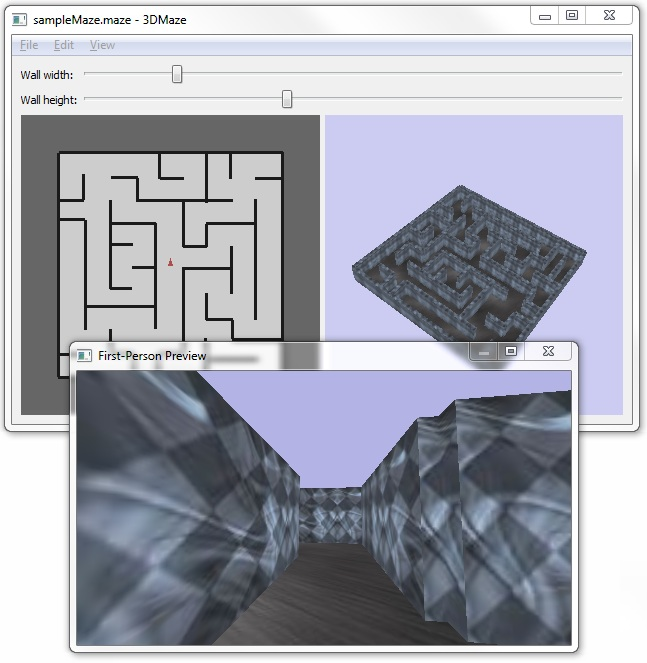

## Welcome!

This is the home of a C++/OpenGL/Qt project created by Jacob Enget.

Recently (after fighting with Win32/MFC for far too long while working on tools at id Software) I've had a bit of a love affair with Qt, Nokia's cross-platform application framework, and decided to revisit an old school project. The assignment (from a computer graphics class I took in 2008) was to create two C++/OpenGL programs from scratch: one that could display a model of a 3D maze, and another that would let the user walk around in the same 3D model. I also added collision detection and reaction, with the ability to jump and adjust the field of view while in first-person view.

Porting the GUI code to Qt made it quite easy to combine all the tools into one application and simplify the maze creation process overall. Now the user can see the results in real-time while editing the maze and quickly get a first-person preview. Here is a screenshot of the application after the Qt conversion:

## Building the 3dmaze application

This project makes us of the [Qt application framework](http://qt.nokia.com/) provided by Nokia. To build this project you'll need to have the Qt SDK installed, and [here](http://qt.nokia.com/products/qt-sdk) is where you can download it.

To build this project you'll also need this project's source code which is available as a zip file [here](http://github.com/jacobenget/3d-maze-creator/archive/master.zip). This project was developed using Qt Creator, the IDE that comes with the Qt SDK, so I'd recommend using Qt Creator to open the project file for 3Dmaze (this file is '3Dmaze.pro' and is found in the source code zip file) and building the project from there. If, instead, you'd like to build the project in a more custom manner and you're familiar with how to use [qmake](http://doc.qt.nokia.com/latest/qmake-manual.html) then feel free to do that instead.

## How to use the 3dmaze application

When running the application you'll see two side-by-side panes. On the left will be a 2D representation of the maze you are editing. On the right will be a 3D representation. All editing is done in the left hand pane with the controls described below, while the effects of your edits are seen in both panes. The current state of the maze can be viewed in first-person by selecting the menu option 'View | Explore Maze In First Person'.

The application has menu options which let you create a new maze, open and save existing ones, and replace the floor and wall textures used in the maze. The application also has two slider bars at the top which can be used to adjust the width and height of the walls in the maze.

## Controls while running these programs

### Edit ( left hand pane )
| User Action | Result |
| -------- | ------- |
| **mouse movement** | moves the wall creation tool |
| **left mouse-click** | creates wall vertex |
| **space bar** | lifts wall creation tool 'off the paper'|
| **right mouse-click** | opens menu for clearing the maze |

### View ( right hand pane )
| User Action | Result |
| -------- | ------- |
| **mouse movement while left-clicking** | rotates the maze |
| **mouse movement while left-clicking + Control Key** | zoom in or out on the maze |
| **mouse movement while left-clicking + Shift Key** | translates the maze vertically or horizontally |
| **mouse movement while left-clicking + Alt/Option Key** | shifts the viewing perspective on the maze, i.e. "fisheye" effect |
| **right mouse-click** | opens menu for reinitializing the placement of the maze |

### Explore ( first person dialog that pops up with Shift+E )
| User Action | Result |
| -------- | ------- |
| **mouse movement** | look around
| **w** |	move forward
| **s** | move backwards
| **a** | move left
| **d** | move right
| **space bar** | jump!
| **r** | zoom-out, i.e. "fisheye" effect
| **c** | zoom-in
| **q** | release the mouse cursor
| **Esc** | close the dialog

### Have Fun!!